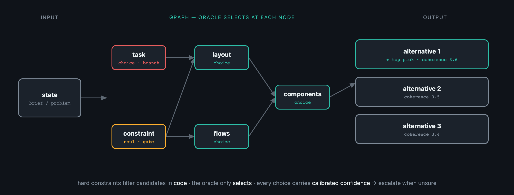

# jev-dag


-FFB02E.svg)


**Resolve a DAG of enumerated decisions with a fast judgment oracle.**



Instead of asking one model to *generate* a whole artifact (where generic "slop" is the modal
sample), you describe the *space* of valid outcomes as a graph of bounded decisions and let an
oracle **select** at each node. [Jev](https://docs.typesafe.ai/api) (TypeSafe) is the default
oracle — fast, cheap, and calibrated — but the oracle is a swappable interface.

Where the candidate sets are closed (e.g. a fixed **design system**, component catalog, or approved
tech radar), every decision is a cheap enumerated selection: no generation, slop-free by
construction, fast, parallelizable, and fully auditable.

> Read the [reasoning](docs/reasoning.md) for the why (sampling → selection), the design-system
> sweet spot, empirical notes, and scaling.

## Install

```bash
git clone https://github.com/AltSlate-Labs/jev-dag && cd jev-dag
pip install -e ".[dev]"
export JEV_KEY=...        # your TypeSafe key — read from env, never committed
```

Core has **no dependencies** (stdlib only; `JevOracle` uses `urllib`). Python ≥ 3.10.

## Quickstart

```python
from jev_dag import Decision, Graph, run, JevOracle

graph = Graph([
    Decision("task", "What is the primary task?",
             candidates=lambda state, ans: {"compare": "Compare records side by side",
                                             "triage": "Work a prioritized queue"}),
    Decision("layout", "Which layout supports that task?",
             depends_on=["task"],                         # sees the 'task' answer
             candidates=lambda state, ans:
                 {"split": "Two panes side by side"} if ans["task"] == "compare"
                 else {"list_detail": "List + detail pane"}),   # hard constraint, in code
])

result = run(graph, "Agents compare two tickets before resolving.", JevOracle())
print(result.top.answers)          # {'task': 'compare', 'layout': 'split'}
print(result.top.trace)            # every decision: candidates, choice, confidence, priors seen
```

Run the worked examples (need `JEV_KEY`):

```bash
python -m examples.tech_stack     # general: choose a web-app stack for a project brief
python -m examples.ui_design      # design: instantiate a small design system for a brief
```

## Concepts

| Piece | What it is |
| --- | --- |
| `Decision` | a node: `id`, `question`, `depends_on`, `kind` (`choice`/`noul`), a `candidates(state, answers)` recipe, optional `activate`, `branch` |
| `Graph` | a validated DAG (acyclic, deps exist), with topological order + transitive ancestors |
| `Oracle` | the decision backend — `choice` / `noul` / `score`. `JevOracle` (default) or `ScriptedOracle` (tests) |
| `run(graph, state, oracle)` | walks the DAG: each node gets the state + **all ancestor answers**, branch nodes fork into alternatives, an optional `coherence` step scores + ranks them |

Design principles the engine enforces:

- **Hard constraints live in code** (your candidate recipe filters *before* the oracle sees options)
  — the oracle can't pick an invalid candidate.
- **Information flows down the DAG** — a node receives every ancestor's answer, not just execution
  order.
- **Branch to explore** — mark a node `branch=True` to keep its top options and produce multiple
  alternatives, then rank them with a coherence `score`.
- **The oracle is the thinnest part** — swap `JevOracle` for any object implementing `Oracle`.

## Testing

```bash
pytest -q            # deterministic, offline (ScriptedOracle); live Jev tests skip without JEV_KEY
```

## License

[MIT](LICENSE) © 2026 AltSlate Labs
